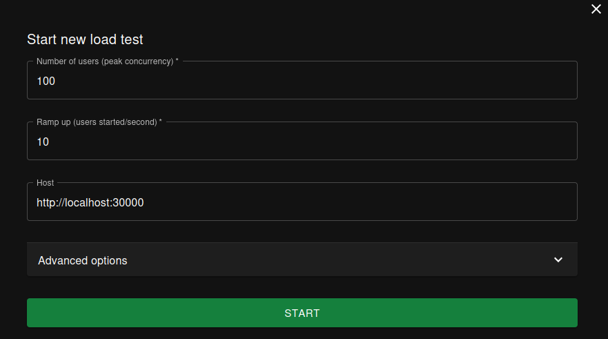
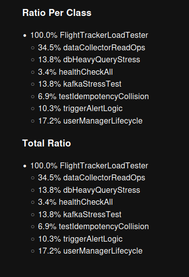
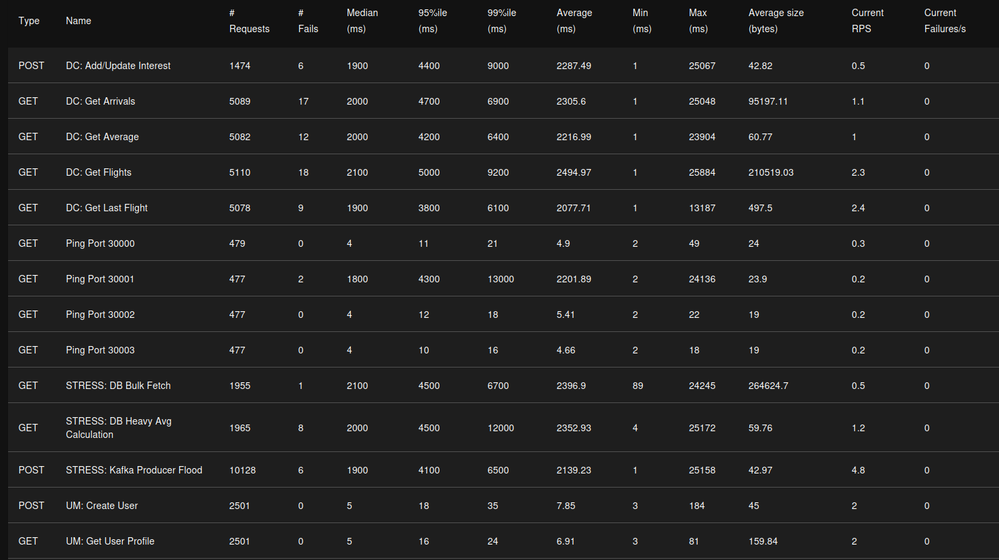
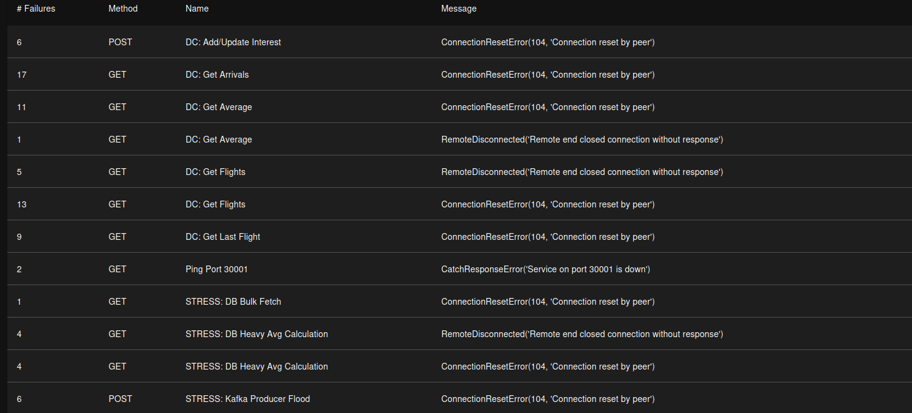
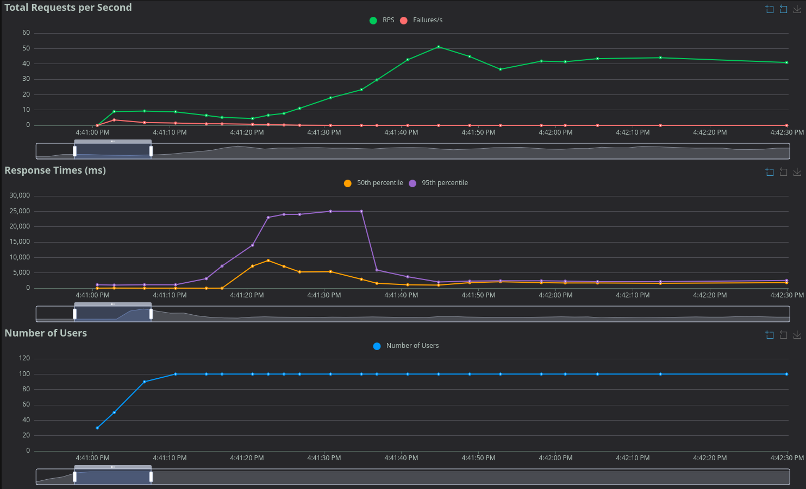
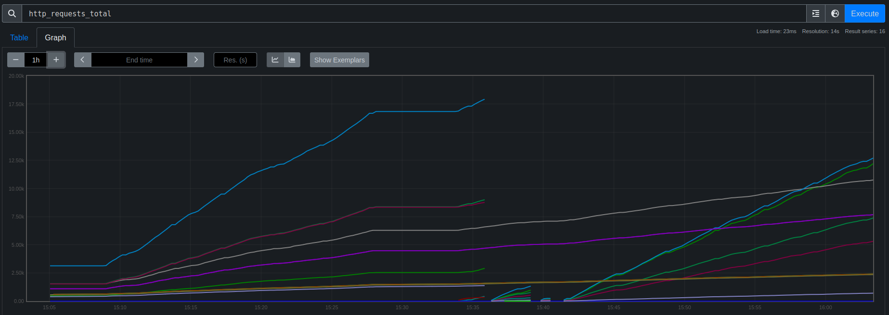

# Project Documentation

## Table of Contents

- [1. Introduction](#1-introduction)
- [2. System Architecture](#2-system-architecture)
  - [2.1. Overview](#21-overview)
  - [2.2. Architectural Diagram](#22-architectural-diagram)
- [3. Components](#3-components)
  - [3.1. API Gateway (Kubernetes Ingress)](#31-api-gateway-kubernetes-ingress)
  - [3.2. User Manager Microservice](#32-user-manager-microservice)
  - [3.3. Data Collector Microservice](#33-data-collector-microservice)
  - [3.4. Alert System Service](#34-alert-system-service)
  - [3.5. Alert Notifier System Service](#35-alert-notifier-system-service)
  - [3.6. SLA Breach Detector Service](#36-sla-breach-detector-service)
  - [3.7. Monitoring (Prometheus)](#37-monitoring-prometheus)
- [4. Implementation Choices](#4-implementation-choices)
  - [4.1. Coding Standards](#41-coding-standards)
- [5. Database Schema](#5-database-schema)
  - [5.1. User Manager DB](#51-user-manager-db)
  - [5.2. Data Collector DB](#52-data-collector-db)
- [6. Setup and Execution](#6-setup-and-execution)
  - [6.1. Prerequisites](#61-prerequisites)
  - [6.2. Configuration](#62-configuration)
  - [6.3. SSL Certificate Generation](#63-ssl-certificate-generation)
  - [6.4. Running the Application](#64-running-the-application)
  - [6.5. Testing with Postman](#65-testing-with-postman)
- [7. At-Most-Once Semantics (Idempotency)](#7-at-most-once-semantics-idempotency)
  - [7.1. Implementation Details](#71-implementation-details)
  - [7.2. How to Test with Postman](#72-how-to-test-with-postman)
    - [Scenario 1: Successful First Request](#scenario-1-successful-first-request)
    - [Scenario 2: Repeated Request (Same Key)](#scenario-2-repeated-request-same-key)
    - [Scenario 3: Creating a User That Already Exists (New Key)](#scenario-3-creating-a-user-that-already-exists-new-key)
    - [Scenario 4: Request Without Idempotency Key](#scenario-4-request-without-idempotency-key)
- [8. Asynchronous Notification Flow](#8-asynchronous-notification-flow)
- [9. Load Testing & Performance Analysis](#9-load-testing--performance-analysis)
  - [9.1. Running a Load Test](#91-running-a-load-test)
  - [9.2. Analyzing Results](#92-analyzing-results)
  - [9.3. Test Report: OOM Crash & Fix](#93-test-report-oom-crash--fix)

## 1. Introduction

This document provides a detailed overview of a distributed systems project, which consists of a microservices-based application orchestrated on **Kubernetes**. The system is designed to manage user data, collect flight information from the OpenSky Network, and provide users with real-time, threshold-based alerts via Telegram. It also includes integrated monitoring via **Prometheus**.

The architecture is composed of four main microservices, an Ingress Controller, a message broker, and a monitoring system:

- **User Manager**: Responsible for handling user registration, deletion, and management of user data, including Telegram chat information.
- **Data Collector**: Responsible for fetching flight data from the OpenSky Network based on user interests (including alert thresholds), storing it, and providing processed data through its API. It is also a Kafka producer.
- **Alert System**: A Kafka consumer and producer that contains the business logic for checking if flight data crosses user-defined thresholds.
- **Alert Notifier System**: A Kafka consumer that sends notifications to users via a Telegram Bot.
- **SLA Breach Detector**: A monitoring service that checks PromQL metrics against configurable thresholds and detects SLA violations.

The project emphasizes a clean, resilient, and scalable architecture, separation of concerns, and robust inter-service communication utilizing patterns like asynchronous messaging, Circuit Breaker, and centralized monitoring.

## 2. System Architecture

### 2.1. Overview

The architecture follows a microservices pattern deployed on a **Kubernetes** cluster. A **Kubernetes Ingress (NGINX Controller)** serves as the single entry point for all external traffic, handling routing requests to the appropriate backend services.

The services themselves are decoupled via an **Apache Kafka** message broker, which orchestrates the asynchronous notification workflow, making the system more resilient and scalable. Internal cross-service communication for synchronous requests (like user validation) is handled efficiently via **gRPC**. Each microservice has its own dedicated PostgreSQL database, ensuring loose coupling and data isolation. **Prometheus** scrapes metrics from the services to monitor system health and performance.

### 2.2. Architectural Diagram


## 3. Components

### 3.1. API Gateway (Kubernetes Ingress)

- **Purpose**: To act as a reverse proxy, providing a single, unified, and secure entry point for the entire system. It routes external HTTP/HTTPS traffic to the internal Kubernetes services.

- **Routing**: Routes requests based on URL prefixes:
  - `/user-manager/*` is routed to the `user-manager` service on port 5000.
  - `/data-collector/*` is routed to the `data-collector` service on port 5000.
  - `/sla-detector/*` is routed to the `sla-breach-detector` service on port 5000.

### 3.2. User Manager Microservice

- **Purpose**: To manage user information, including creation, deletion, retrieval of user data, and Telegram notification details.

- **API Endpoints** (accessed via `/user-manager/` prefix):
  - `GET /metrics`: Prometheus metrics endpoint.
  - `GET /ping`: A health check endpoint.
  - `POST /users`: Creates a new user.
    - **Request Body**: `{"email": "...", "first_name": "...", "last_name": "...", "tax_code": "...", "iban": "..."}`
    - **Response**: `{"message": "User created successfully"}`
  - `GET /users`: Retrieves a list of all users.
  - `GET /users/<email>`: Retrieves a single user by email.
  - `DELETE /users/<email>`: Deletes a user by email.
  - `POST /users/telegram`: Associates a numeric Telegram Chat ID with a user's email.
    - **Request Body**: `{"email": "...", "telegram_chat_id": "..."}`

- **gRPC Service**:
  - **Service**: `UserService`
  - **Method**: `CheckUserExists(UserRequest) returns (UserResponse)`
    - **Description**: Checks if a user with the given email exists in the database. Called by the `Data Collector`.

### 3.3. Data Collector Microservice

- **Purpose**: To collect flight data based on user interests, store it, and provide endpoints for data retrieval and analysis. It runs a background job to periodically fetch data from the OpenSky Network.

- **API Endpoints**:
  - `GET /metrics`: Prometheus metrics endpoint.
  - `GET /ping`: A health check endpoint.
  - `POST /interests`: Adds a new airport interest for a user. Accepts optional `high_value` and `low_value` fields.
  - `PUT /interests`: Updates `high_value` and `low_value` for an existing interest.
  - `DELETE /interests`: Removes an airport interest for a user.
  - `GET /interests/<email>`: Retrieves all airport interests for a user.
  - `GET /flights/<airport_code>`: Retrieves flights for a specific airport.
    - **Query Parameter**: `type` (optional) can be set to `arrivals` or `departures` to filter results.
  - `GET /flights/average/<icao>`: Calculates the average number of flights per day for an airport.
  - `GET /flights/last/<icao>`: Returns the most recent flight recorded for an airport.

- **Circuit Breaker**: All calls to the OpenSky Network API are wrapped in a Circuit Breaker (using `pybreaker`). If the API fails 5 consecutive times, the circuit opens for 60 seconds to allow the external service to recover.

- **Mock Data Generator**: To ensure system continuity even when the OpenSky API is unavailable (or the request limit is reached), the service includes a fallback mechanism. If the API call fails or the circuit is open, the service generates realistic mock flight data. This feature is particularly useful for development and testing purposes, allowing the entire pipeline (alerts, notifications) to function without external dependencies.

- **Background Job**: A background thread runs every **5 minutes**. It iterates through all unique airports stored in the user interests, fetches the latest flight data (via API or mock), saves it to the database, and triggers the alert evaluation process by sending messages to Kafka.

- **Kafka Producer**: After fetching flight data, it produces a message to the `to-alert-system` Kafka topic for each relevant user interest.

- **gRPC Service**:
  - **Service**: `DataCollectorService`
  - **Method**: `DeleteUserInterests(UserRequest) returns (DeleteInterestsResponse)`
    - **Description**: Deletes all interests associated with a user's email. Called by the `User Manager`.

### 3.4. Alert System Service

- **Architectural Role**: A lightweight, standalone stream processing service. It does not expose any APIs and its sole purpose is to apply business logic to the stream of data produced by the `data-collector`.

- **Functionality**:
  - Acts as a Kafka **consumer**, listening to the `to-alert-system` topic.
  - For each message, it compares the `flight_count` with the user's `high_value` and `low_value`.
  - If a threshold is crossed, it acts as a Kafka **producer**, sending a formatted alert message to the `to-notifier` topic.

### 3.5. Alert Notifier System Service

- **Architectural Role**: A standalone service responsible for the final step of the notification pipeline: dispatching messages to the user.

- **Functionality**:
  - Acts as an asynchronous Kafka **consumer** (using `aiokafka`), listening to the `to-notifier` and `sla_breach` topics.
  - Upon receiving an alert, it **connects directly to the `user-manager`'s PostgreSQL database** to retrieve the `telegram_chat_id` for the user's email.
  - It uses the Telegram Bot API to send the final alert message to the user.

### 3.6. SLA Breach Detector Service

- **Architectural Role**: A standalone monitoring service that acts as a metrics watchdog. It periodically samples Prometheus metrics and applies business rules to detect Service Level Agreement (SLA) violations.

- **Functionality**:
  - **Configuration Loading**: At startup, reads an SLA configuration file (`config.yaml`) containing, for each GAUGE metric: name, PromQL query, `min`, and `max` thresholds.
  - **Periodic Sampling**: Executes a job every `T_check` seconds. The constraint `T_check >= 5 * T_scrape` is enforced to ensure stable metric readings.
  - **Prometheus Integration**: Queries Prometheus via HTTP API (`/api/v1/query`) to obtain the current value of each configured metric.
  - **Internal History**: Maintains a sliding window of the last 10 samples per metric.
  - **Breach Rule**: If at least 3 samples fall below `min` **OR** at least 3 samples exceed `max`, an SLA breach event is generated.
  - **Notification**: Acts as a Kafka **producer**, sending breach events to the `sla_breach` topic with: timestamp, metric name, query, observed value, violated threshold, breach type (low/high), and violation count.

- **API Endpoints**:
  - `GET /sla/config`: Returns the current SLA configuration.
  - `POST /sla/config`: Dynamically updates the monitored metrics and thresholds. Validates the `T_check >= 5 * T_scrape` constraint.
  - `GET /breach/stats`: Returns breach statistics per metric since service startup.
  - `GET /metrics`: Prometheus metrics endpoint for self-monitoring.
  - `GET /health`: Health check endpoint.
  - `GET /ping`: Liveness probe endpoint.

### 3.7. Monitoring (Prometheus)

- **Purpose**: To collect and aggregate metrics from the microservices.

- **Functionality**:
  - Prometheus is deployed as a service in the cluster.
  - It scrapes the `/metrics` endpoints of the `user-manager`, `data-collector`, and `sla-breach-detector` services.
  - This allows for real-time monitoring of request counts, latencies, and other custom metrics (e.g., OpenSky API call duration, flights fetched).
- **Accessing the Dashboard**: To access the Prometheus web interface from your local machine, use the following command to forward the port:

    ```bash
    kubectl port-forward svc/prometheus 9090:9090
    ```

    Once the command is running, the dashboard will be available at `http://localhost:9090`.

## 4. Implementation Choices & Design Rationale

This section details the technological stack and the architectural decisions taken during development, highlighting the trade-offs and motivations behind each choice.

- **Orchestration (Kubernetes & Kind)**:
  - **Kubernetes** was chosen to provide a production-grade container orchestration environment, ensuring automatic scaling, self-healing, and service discovery.
  - For local development, we utilized **Kind (Kubernetes in Docker)**. The project defaults to a **Single-Node Cluster** configuration (acting as both control-plane and worker) to minimize resource consumption on developer machines. However, the deployment script (`deploy.sh`) includes commented-out configuration to easily switch to a **Multi-Node Cluster** (1 Control Plane + 2 Workers) to validate distributed behavior and networking policies in a more realistic scenario if hardware resources permit.

- **Language & Frameworks (Python & Flask)**:
  - **Python** was selected for its rich ecosystem, particularly for data processing and API integration.
  - **Flask** was chosen for the microservices (`user-manager`, `data-collector`) over heavier frameworks like Django because of its lightweight nature and flexibility. This allows for lower overhead and faster startup times, which are critical properties for microservices that might need to scale horizontally.

- **API Gateway (Kubernetes Ingress)**:
  - **NGINX Ingress Controller** serves as the unified entry point for the cluster. It handles routing and SSL termination, abstracting the complexity of the internal network topology from the client. This centralization simplifies security policies and traffic management.

- **Message Broker (Apache Kafka)**:
  - **Kafka** was chosen to implement the asynchronous, event-driven communication pattern between the Data Collector and the Alert System. Unlike simpler message queues (e.g., RabbitMQ), Kafka's log-based persistence ensures high durability and replayability of events, which is crucial for auditing and reliability in distributed alerting systems.

- **Database (PostgreSQL vs. Redis)**:
  - **PostgreSQL** serves as the persistence layer for both microservices.
  - **Rationale for Idempotency**: While key-value stores like Redis are often used for idempotency keys due to their speed and TTL support, we implemented the idempotency check using a dedicated table in **PostgreSQL**. Since the application already required a relational database for user data, leveraging PostgreSQL for idempotency avoids introducing an additional infrastructure component (Redis) to manage and secure. The transactional integrity (ACID) of PostgreSQL ensures that the check-then-set operation for the idempotency token (provided by the client via a GUID) is atomic and consistent.

- **Inter-service Communication (gRPC)**:
  - **gRPC** (using Protocol Buffers) was chosen for synchronous, internal communication between the `User Manager` and `Data Collector` (e.g., checking user existence). Compared to REST/JSON, gRPC offers lower latency, smaller payload size, and strict contract definition via `.proto` files, which reduces the risk of schema mismatch errors between services.

- **Resilience (PyBreaker)**:
  - **PyBreaker** implements the Circuit Breaker pattern to protect the system from cascading failures when the external OpenSky Network API is unreachable or rate-limited.

- **Asynchronous I/O (AIOKafka & Asyncio)**:
  - The `alert-notifier-system` utilizes **Asyncio** and **AIOKafka** to handle high-throughput I/O operations non-blockingly. This ensures that the service can process incoming Kafka messages and send Telegram network requests concurrently without being bottlenecked by network latency.

### 4.1. Monitoring Strategy (Prometheus Labels)

The monitoring system is designed to provide granular visibility into system behavior. We utilize custom labels to isolate performance bottlenecks and track specific logic flows:

- **`airport_code`**: This label is attached to the Data Collector metrics (e.g., `opensky_fetch_time`). It allows operators to distinguish whether high latency is a global issue or specific to fetching data for a particular airport (e.g., larger airports processing more flight data).
- **`service`**: Identifies the source microservice for generic metrics like HTTP requests, allowing aggregated views of health across the cluster.
- **`status`**: Used in notification metrics to track the success versus failure rate of Telegram API calls separately, enabling quick detection of authentication issues or API outages.

### 4.2 Coding Standards

The Python code in this project adheres to the **PEP 8** style guide to ensure consistency and readability. All docstrings for modules, classes, and functions are written to comply with the **PEP 257** standard, providing clear and comprehensive documentation directly within the code.

## 5. Database Schema

### 5.1. User Manager DB

- **`users` table**:
  - `email` (String, Primary Key)
  - `first_name` (String)
  - `last_name` (String)
  - `tax_code` (String, Optional, Unique)
  - `iban` (String, Optional)
  - `telegram_chat_id` (String, Optional, Unique)

- **`idempotency_keys` table**:
  - `key` (String, Primary Key) - The unique idempotency key provided by the client.
  - `status` (String) - Current status of the request (`in-progress`, `completed`).
  - `created_at` (DateTime) - Timestamp of when the key was created.
  - `response_code` (Integer, Optional) - HTTP status code of the cached response.
  - `response_body` (Text, Optional) - JSON body of the cached response.
  - `user_email` (String) - Email of the user associated with the request (not a foreign key).

### 5.2. Data Collector DB

- **`user_interests` table**:
  - `id` (Integer, Primary Key)
  - `user_email` (String)
  - `airport_code` (String)
  - `high_value` (Integer, Optional)
  - `low_value` (Integer, Optional)
- **`flight_data` table**:
  - `id` (Integer, Primary Key)
  - `icao24` (String)
  - `first_seen` (DateTime)
  - `est_departure_airport` (String, Optional)
  - `last_seen` (DateTime)
  - `est_arrival_airport` (String, Optional)
  - `callsign` (String, Optional)
  - `est_departure_airport_horiz_distance` (Integer, Optional)
  - `est_departure_airport_vert_distance` (Integer, Optional)
  - `est_arrival_airport_horiz_distance` (Integer, Optional)
  - `est_arrival_airport_vert_distance` (Integer, Optional)
  - `departure_airport_candidates_count` (Integer, Optional)
  - `arrival_airport_candidates_count` (Integer, Optional)

## 6. Setup and Execution

### 6.1. Prerequisites

- Docker
- Kind (Kubernetes in Docker)
- kubectl
- OpenSSL (for generating SSL certificate)

### 6.2. Configuration

1. **Environment Variables**: The project uses a `.env` file for building images and `kubernetes/secrets.yaml` for the runtime configuration in the cluster.
2. **Secrets**: Open `kubernetes/secrets.yaml` and update the Base64-encoded placeholders (or plain text if configuring before applying) with your actual credentials:
    - `OPEN_SKY_CLIENT_ID`
    - `OPEN_SKY_CLIENT_SECRET`
    - `TELEGRAM_BOT_TOKEN`
    - Database credentials.

### 6.3. SSL Certificate Generation

For HTTPS to work locally via Ingress, you need to generate a self-signed certificate.

Run the following command from the project's root directory:

```bash
openssl req -x509 -nodes -days 365 -newkey rsa:2048 \
  -keyout nginx/ssl/nginx-selfsigned.key \
  -out nginx/ssl/nginx-selfsigned.crt \
  -subj "/C=IT/ST=Italy/L=CT/O=Uni/OU=Dev/CN=localhost"
```

This will create the necessary `.key` and `.crt` files in the `nginx/ssl/` directory.

### 6.4. Running the Application

The project includes a helper script to automate the deployment process on a local Kind cluster. You can view the full usage information by running `./kubernetes/deploy.sh -h`.

1. **Make the script executable**:

    ```bash
    chmod +x kubernetes/deploy.sh
    ```

2. **Run the deployment script**:

    ```bash
    ./kubernetes/deploy.sh [ACTION] [OPTIONS]
    ```

    **Actions:**
    - `up` (default): Create cluster, build images, and deploy.
    - `down`: Delete the kind cluster.
    - `stop-pf`: Stop all active port-forwarding processes.

    **Options for 'up':**
    - `--pf`, `--port-forward`: Automatically start port-forwarding after deployment to access services on localhost ports (5000-5003).
    - `--ingress`: Install NGINX Ingress Controller and enable Ingress access on port 80/443.

3. **Verify Deployment**:
    Check the status of the pods:

    ```bash
    kubectl get pods
    ```

    Wait until all pods are in the `Running` state.

    If you used `--ingress`, the services are accessible via Ingress at **`https://localhost`** (HTTP traffic is redirected).
    If you used `--pf`, services are at **`http://localhost:5000`**, etc.

### 6.5. Testing with Postman

The repository includes a Postman collection file: `DSBD.postman_collection.json`. You can import this file into Postman to get a pre-configured set of requests for all the main API endpoints. Ensure the base URL is set to `https://localhost`.

## 7. At-Most-Once Semantics (Idempotency)

To ensure robustness and prevent duplicate data processing in case of network failures or client retries, the system implements an "at-most-once" delivery guarantee for all state-changing operations in the `User Manager` service (`POST /users` and `DELETE /users/<email>`).

### 7.1. Implementation Details

The idempotency logic is handled at the application layer using a combination of a request header and a dedicated database table.

1. **Idempotency-Key Header**: The client must send a unique identifier for each state-changing request in an `Idempotency-Key` HTTP header.

2. **`idempotency_keys` Table**: A table in the `user_manager_db` is used to store the status and result of each request. The table includes the idempotency key, the status of the request (`in-progress` or `completed`), and the response body and status code that were originally returned.

3. **Execution Flow**:
    - When a request with an `Idempotency-Key` arrives, the server first checks the `idempotency_keys` table.
    - **If the key exists and its status is `completed`**, the server immediately returns the stored response without re-processing the request.
    - **If the key exists and its status is `in-progress`**, it means a concurrent request with the same key is being processed. The server returns a `409 Conflict` error to prevent a race condition.
    - **If the key does not exist**, the server creates a new entry in the table with the status `in-progress`, executes the business logic (e.g., creates the user), and then updates the entry with the status `completed` along with the final response body and code.

This mechanism ensures that an operation is performed at most once, even if the client sends the same request multiple times.

### 7.2. How to Test with Postman

Here is a detailed guide on how to test the idempotency implementation.

#### Initial Setup

1. **`Content-Type` Header**: For `POST` requests, set the `Content-Type` header to `application/json`.
2. **`Idempotency-Key` Header**: Add an `Idempotency-Key` header to your `POST /user-manager/users` and `DELETE /user-manager/users/<email>` requests.

#### Scenario 1: Successful First Request

1. **Action**:
    - Create a `POST /users` request to `https://localhost/user-manager/users`.
    - In **Headers**, set `Idempotency-Key` to `{{$guid}}`. This Postman variable generates a new GUID for each request.
    - In the **Body**, provide the user's JSON data.
    - Send the request.
2. **Expected Result**: A `201 Created` response. The user and the idempotency key are stored in the database.

#### Scenario 2: Repeated Request (Same Key)

1. **Action**:
    - Take the previous request. **Do not change the `Idempotency-Key`**. If you used `{{$guid}}`, copy the value that was actually sent and paste it as a static value or repeat the **scenario 1** forcing a key, for example: `3f9d2e1b-8c4a-4d6f-b1e2-5a7f8c2d9e4a`.
    - Send the request again.
2. **Expected Result**: An immediate `201 Created` response. The server returns the cached response, and no new user is created. You will not see a "duplicate key" error from the database in the service logs.

#### Scenario 3: Creating a User That Already Exists (New Key)

1. **Action**:
    - Create a `POST /users` request for a user that already exists.
    - Use a **new** `Idempotency-Key` (e.g., use `{{$guid}}` again).
    - Send the request.
2. **Expected Result**: A `409 Conflict` response. The server attempts to create the user, the database reports a conflict, and this "conflict" result is then cached for the new idempotency key.

#### Scenario 4: Request Without Idempotency Key

1. **Action**:
    - Disable or remove the `Idempotency-Key` header from the request.
    - Send it.
2. **Expected Result**: A `400 Bad Request` with an error message indicating that the header is required.

## 8. Asynchronous Notification Flow

The notification system is designed following an event-driven architecture, orchestrated by Apache Kafka. This approach decouples the primary services from the notification logic, leading to a more resilient and scalable system. If a notification service fails, the events remain in Kafka, ready to be processed once the service recovers, preventing data loss.

The flow is divided into three main stages: data production, alert evaluation, and notification dispatch.

1. **Data Production**: A user registers an interest in an airport with specific alert thresholds (e.g., `LICC`, `high_value: 2`) by sending a `POST` request to `/data-collector/interests`. When the `data-collector`'s background job fetches new data from the OpenSky Network, it acts as a Kafka producer. For each user interest associated with that airport, it produces a JSON message to the `to-alert-system` topic with the relevant details: `{"user_email": "...", "airport_code": "LICC", "flight_count": 10, "high_value": 2, "low_value": 1}`.

2. **Alert Evaluation**: The `alert-system` service, acting as a Kafka consumer, listens for messages on the `to-alert-system` topic. Upon receiving a message, it executes its sole business logic: it compares the `flight_count` against the `high_value` and `low_value`. In our example, `10` is greater than `2`, so the condition is met.

3. **Notification Trigger**: Since the condition is met, the `alert-system` acts as a producer and sends a new, more specific message to the `to-notifier` topic. This message confirms that an alert must be sent and contains the necessary information: `{"user_email": "...", "airport_code": "LICC", "condition": "The number of flights (10) exceeded the high threshold of 2."}`.

4. **Notification Dispatch**: The `alert-notifier-system` service consumes this final message from the `to-notifier` topic. It then performs a query on the `user_manager`'s database to find the `telegram_chat_id` corresponding to the user's email.

5. **Message Delivery**: Finally, using the retrieved Chat ID, the service connects to the Telegram Bot API and sends the formatted alert message directly to the user, completing the workflow.

### 8.1. SLA Breach Notification Flow

The system also handles SLA violations via a dedicated asynchronous flow:

1.  **Monitoring**: The `sla-breach-detector` queries Prometheus metrics.
2.  **Breach Detection**: If the breach rule (e.g., 3 consecutive samples out of range) is met, it produces a message to the `sla_breach` topic.
3.  **Consumption & Routing**: The `alert-notifier-system` consumes the message from the `sla_breach` topic.
4.  **Admin Notification**: The system identifies the admin user (defaulting to `mario.rossi@gmail.com`) and sends a high-priority Telegram alert with the breach details (metric, observed value, threshold).

## 9. Load Testing & Performance Analysis

To validate the system's resilience and scalability, we integrated **Locust**, a Python-based load testing tool.

### 9.1. Running a Load Test

1. **Start Locust**:
    Run the following command from the project root:

    ```bash
    locust
    ```

2. **Access Dashboard**: Open [http://localhost:8089](http://localhost:8089).
3. **Configure Swarm**:
    - **Users**: 100 (peak concurrency)
    - **Spawn Rate**: 10 (users/sec)
    - **Host**: `http://localhost:30000` (User Manager NodePort)

    
    *Figure 3: Configuring the user swarm in Locust.*

4. **Monitor**:
    - Observe the **RPS (Requests Per Second)** and **Failures** tab in Locust.
    - Correlate with **Prometheus** metrics at [http://localhost:30090](http://localhost:30090).

### 9.2. Analyzing Results

Locust provides several views to understand the system's behavior under load.

- **Ratio**: Indicates how the simulated users distribute their actions across the different tasks defined in `locustfile.py`.
    
    *Figure 4: Task distribution ratio.*

- **Statistics**: A real-time summary of requests and latency metrics.
    
    *Figure 5: Aggregated performance statistics.*

- **Failures**: Detailed logs of any errors encountered.
    
    *Figure 6: Log of failed requests during the stress test.*

- **Charts**: Visualizing the flow of users, RPS, and failures over time.
    
    *Figure 7: Real-time charts showing the correlation between user load and system response.*

- **Prometheus Correlation**: We can cross-reference Locust data with internal metrics in Prometheus, such as `http_requests_total`.
    
    *Figure 8: Prometheus graph confirming the traffic spike generated by Locust.*

### 9.3. Test Report: OOM Crash & Fix

During the initial load test (100 users, 10 spawn rate), we observed a critical stability issue:

- **Observation**: The `data-collector` pod crashed repeatedly (`CrashLoopBackOff`) after a few minutes of sustained load. Prometheus targets showed the service as `DOWN`, and Locust reported connection errors.
- **Root Cause Analysis**: Kubernetes logs revealed an **OOMKilled** (Out Of Memory) error with exit code **137**. The container had exceeded its hard limit of **256Mi**.
- **Resolution**: We increased the memory limit to **512Mi** in the `data-collector-deployment.yaml` manifest.
- **Verification**: A subsequent test ran successfully with **zero failures** over 1600+ requests. We observed that the `data-collector` exhibits higher latency (~1.5s) compared to the lightweight `user-manager` (~20ms), which is consistent with the heavier computational load of processing flight data.
